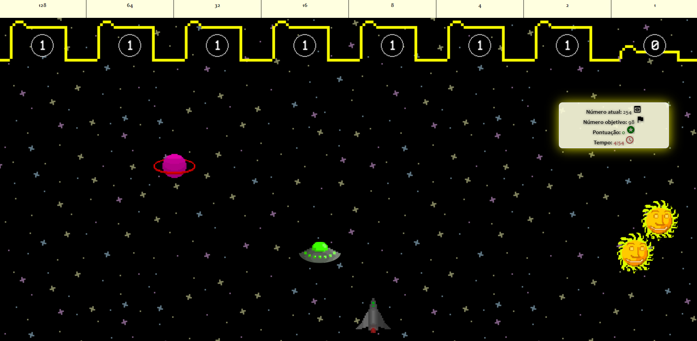

# Binary Wars

Bem-vindo ao Binary Wars, um jogo educativo divertido e desafiador para aqueles que desejam exercitar a conversão de números decimais para números binários. Como piloto de nave, você deve atirar em alienígenas e encontrar a combinação certa de 1 e 0 para resolver problemas e avançar para o próximo nível.

# Como jogar

- Acesse https://wdpedroborges.github.io/binary-wars/
- Use as setas do teclado para se mover pela tela e barra de espaço atirar em alienígenas.
- Quando você encontrar um problema, use a combinação correta de 1 e 0 para resolvê-lo.

# Recursos

- Gráficos coloridos e animações suaves para uma jogabilidade envolvente
- Problemas cada vez mais difíceis para desafiar jogadores de todos os níveis
- Pontuação e para medir o seu progresso

# Tecnologias usadas

- HTML
- CSS
- JavaScript puro

# Como contribuir

Se você deseja contribuir para este projeto, fique à vontade para enviar uma solicitação de pull. Todas as contribuições serão analisadas e consideradas.

# Licença

Este projeto está licenciado sob a licença MIT. Veja o arquivo [LICENSE](LICENSE.txt) para mais detalhes.

# Créditos

Este projeto foi desenvolvido por Pedro Borges.

Divirta-se jogando e aprendendo com Binary Wars!